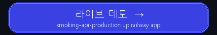
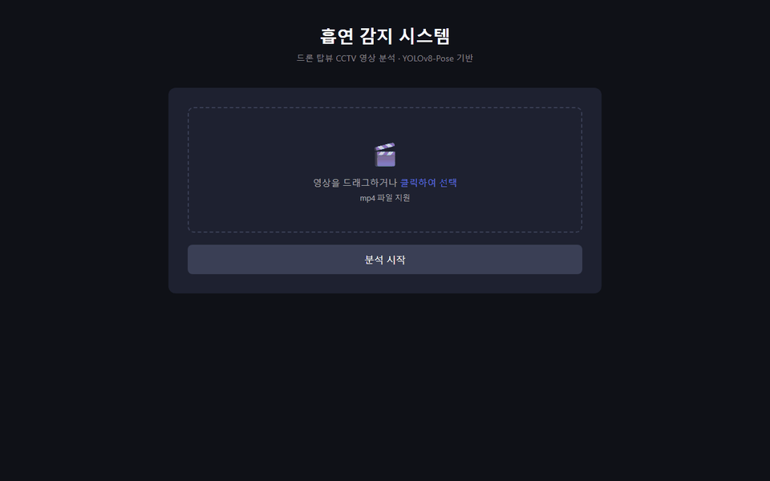
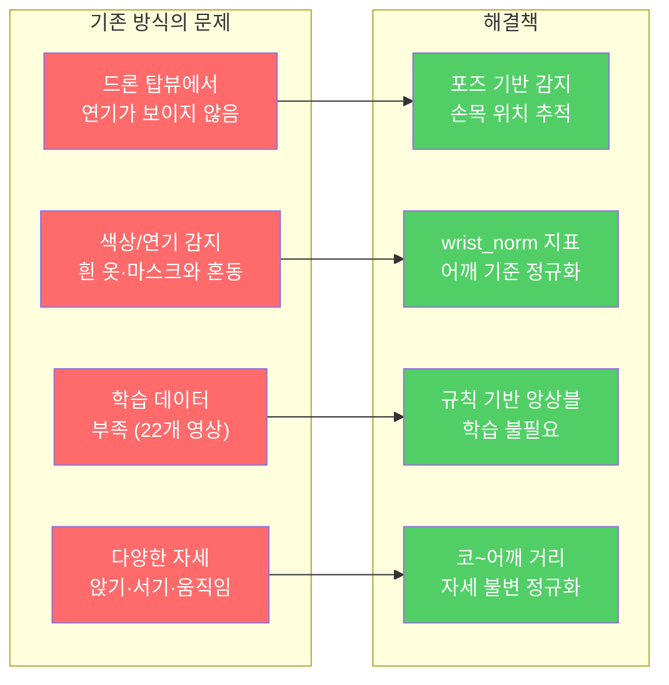
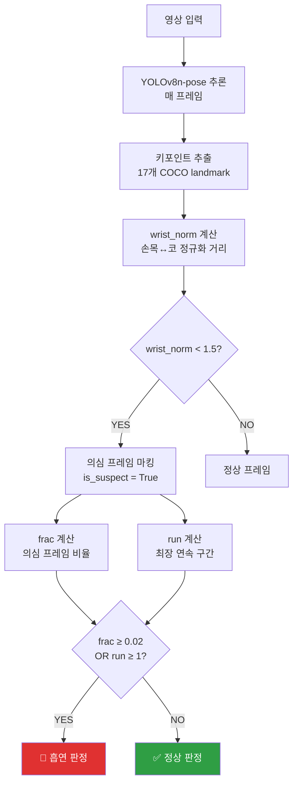
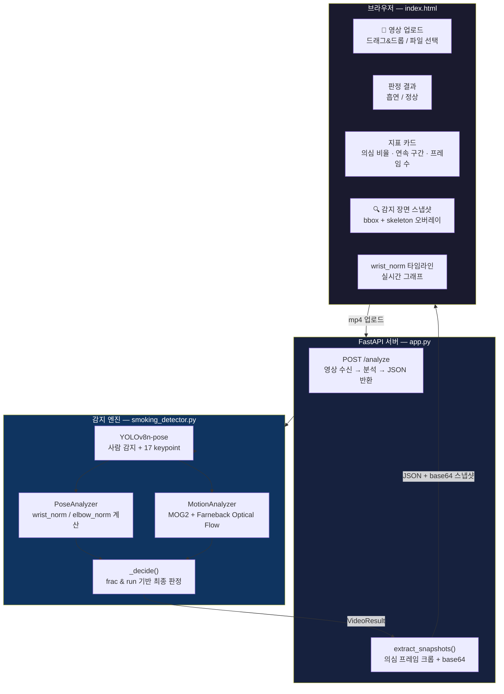
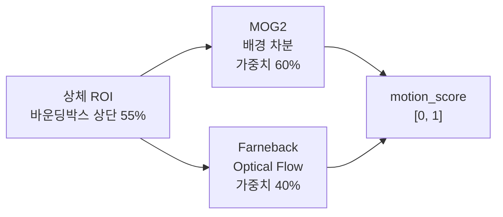
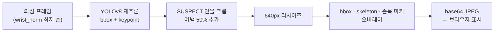
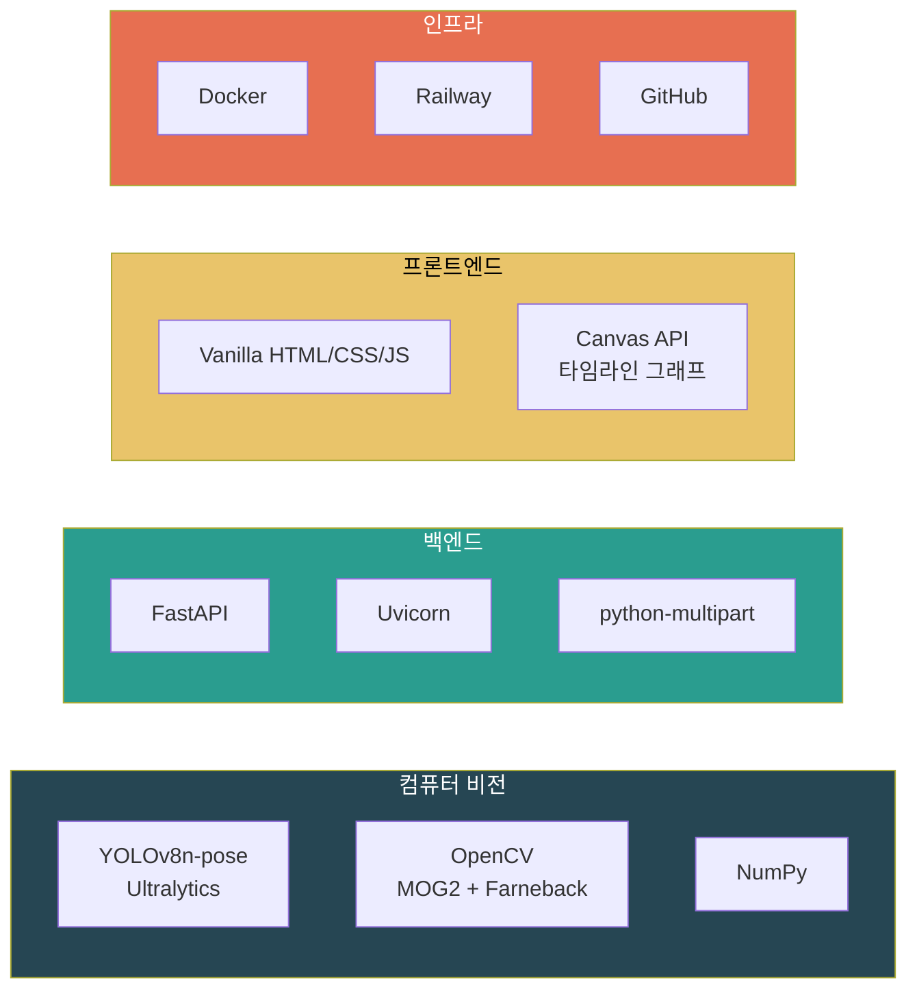
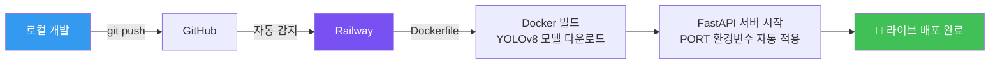
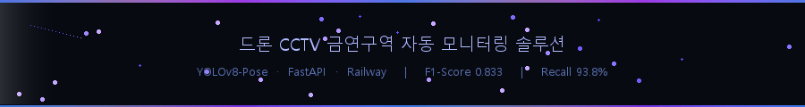

<div align="center">

# 흡연 감지 시스템

### 드론 탑뷰 CCTV × YOLOv8-Pose × 규칙 기반 포즈 분석

[](https://smoking-api-production.up.railway.app/)
[](https://python.org)
[](https://fastapi.tiangolo.com)
[](https://ultralytics.com)
[](https://railway.app)

<br/>

**드론 탑뷰 CCTV 영상에서 연기 없이 자세만으로 흡연을 감지합니다.**<br/>
YOLOv8-Pose 키포인트 추적 + 손목 정규화 지표 + 시간적 지속성 앙상블.

[시스템 구조](#-시스템-구조) · [핵심 알고리즘](#-핵심-알고리즘) · [성능](#-성능-평가) · [실행 방법](#-실행-방법)

<br/>

[](https://smoking-api-production.up.railway.app/)

<br/>



</div>

---

## 목차

- [프로젝트 소개](#-프로젝트-소개)
- [핵심 아이디어](#-핵심-아이디어)
- [시스템 구조](#-시스템-구조)
- [핵심 알고리즘](#-핵심-알고리즘)
- [성능 평가](#-성능-평가)
- [파일 구성](#-파일-구성)
- [기술 스택](#-기술-스택)
- [실행 방법](#-실행-방법)

---

## 프로젝트 소개

> [!IMPORTANT]
> **드론 탑뷰에서는 연기가 보이지 않습니다.** — 기존 연기/색상 감지 방식은 원천 불가능합니다.

공원, 금연구역, 건물 외곽의 드론 CCTV에서 흡연자를 자동으로 탐지합니다.
연기 대신 **손이 입으로 향하는 포즈**를 측정하는 완전히 새로운 접근 방식을 사용합니다.

### 문제 정의 & 해결책



---

## 핵심 아이디어

### wrist_norm — 핵심 지표

흡연 동작의 본질은 **손을 입으로 반복적으로 올리는 것**입니다.

$$\text{wrist\_norm} = \frac{\min(\text{wrist}_y) - \text{nose}_y}{\text{shoulder}_y - \text{nose}_y}$$

| wrist_norm 값 | 의미 |
|:---:|:---|
| **< 0.5** | 손이 코보다 위 → 강한 흡연 의심 |
| **0.5 ~ 1.5** | 손이 얼굴~어깨 사이 → 의심 |
| **> 1.5** | 손이 어깨 아래 → 정상 |

> [!NOTE]
> 드론 탑뷰에서는 앉거나 서거나 상관없이 **코~어깨 거리**로 정규화하면 자세 변화에 강인합니다.

### COCO Keypoint 매핑

```
NOSE(0) ─── 기준점
  │
L_SHOULDER(5) ─── R_SHOULDER(6)   ← 정규화 기준
  │                       │
L_ELBOW(7)           R_ELBOW(8)
  │                       │
L_WRIST(9) ◉         ◉ R_WRIST(10)  ← 추적 대상
```

### 판정 로직



---

## 시스템 구조



---

## 핵심 알고리즘

### 1. PoseAnalyzer — 손목 정규화

```python
wrist_norm = (min(wrist_y) - nose_y) / (shoulder_y - nose_y)
```

- 드론 탑뷰 특성상 몸 전체가 작게 보임
- 절대 픽셀 거리 대신 **신체 비율로 정규화** → 거리·각도 불변
- 어깨 미검출 시 편측 어깨로 fallback

### 2. MotionAnalyzer — 상체 모션



흡연 동작의 특징인 **손 상하 반복 운동** → y축 광학 흐름 우세 탐지

### 3. 시간적 판정 (OR 앙상블)

| 단서 | 조건 | 의미 |
|:---:|:---:|:---|
| `frac` | ≥ 0.02 | 전체 프레임의 2% 이상이 의심 포즈 |
| `run` | ≥ 1 | 연속 의심 프레임이 1개 이상 존재 |

- **OR 조건**: 단 1프레임이라도 강한 의심 시 즉시 판정
- 짧은 순간의 흡연 동작도 놓치지 않음 (높은 Recall)

### 4. 스냅샷 — SUSPECT 크롭 확대



---

## 성능 평가

> 22개 영상 (흡연 16개 · 정상 5개 · 세팅 1개), 규칙 기반 — 학습 없음

| 지표 | 값 |
|:---:|:---:|
| **F1-Score** | **0.8333** |
| **Recall** | **93.8%** |
| **Precision** | **75.0%** |
| **Accuracy** | **71.4%** |

```
TP=15  TN=0  FP=5  FN=1
```

> [!NOTE]
> FP 5건은 흰 마스크·모자를 착용한 인물이 손을 올리는 동작으로, 규칙 기반의 구조적 한계입니다.
> FN 1건은 앉은 자세로 인해 키포인트 검출이 불안정한 경우입니다.

### 파라미터

| 파라미터 | 값 | 설명 |
|:---:|:---:|:---|
| `FRAC_THRESH_T` | 0.50 | frac 계산 wrist_norm 임계값 |
| `FRAC_THRESH_VAL` | 0.02 | 흡연 판정 최소 의심 비율 |
| `RUN_THRESH_T` | 1.50 | run 계산 wrist_norm 임계값 |
| `RUN_THRESH_N` | 1 | 최장 연속 구간 최소값 |

---

## 파일 구성

```
smoking-detection/
├── app.py                  # FastAPI 서버 + 스냅샷 생성
├── smoking_detector.py     # 감지 엔진 (PoseAnalyzer · MotionAnalyzer · SmokingDetector)
├── make_videos.py          # 결과 동영상 생성 (overlay + analysis)
├── index.html              # 웹 UI (업로드 · 결과 · 그래프 · 스냅샷)
├── requirements.txt        # Python 의존성
└── Dockerfile              # Railway 배포용
```

---

## 기술 스택



| 분류 | 기술 | 용도 |
|:---:|:---:|:---|
| **포즈 감지** | YOLOv8n-pose | 17개 COCO 키포인트 추출 |
| **모션 분석** | OpenCV MOG2 | 배경 차분 기반 활동량 측정 |
| **광학 흐름** | Farneback | 상체 y축 움직임 측정 |
| **백엔드** | FastAPI + Uvicorn | REST API + 정적 파일 서빙 |
| **프론트엔드** | Vanilla JS + Canvas | 업로드 UI + 타임라인 그래프 |
| **배포** | Railway + Docker | 컨테이너 기반 클라우드 배포 |

---

## 실행 방법

### 사전 요구사항

> [!WARNING]
> CUDA GPU 환경 권장 (CPU에서도 동작하나 영상당 30~60초 소요)

- Python 3.11+
- CUDA 지원 GPU (선택사항)

### 로컬 실행

```bash
# 1. 저장소 클론
git clone https://github.com/Technoetic/smoking-detection.git
cd smoking-detection

# 2. 의존성 설치
pip install -r requirements.txt

# 3. 서버 실행
python app.py

# 4. 브라우저 접속
open http://localhost:8000
```

### Docker 실행

```bash
docker build -t smoking-detection .
docker run -p 8000:8000 smoking-detection
```

### Railway 배포

```bash
railway up
```

### 배포 흐름



---

<div align="center">

**드론 CCTV 인프라를 위한 금연구역 자동 모니터링 솔루션**

[](https://railway.app)

<br/>



</div>
